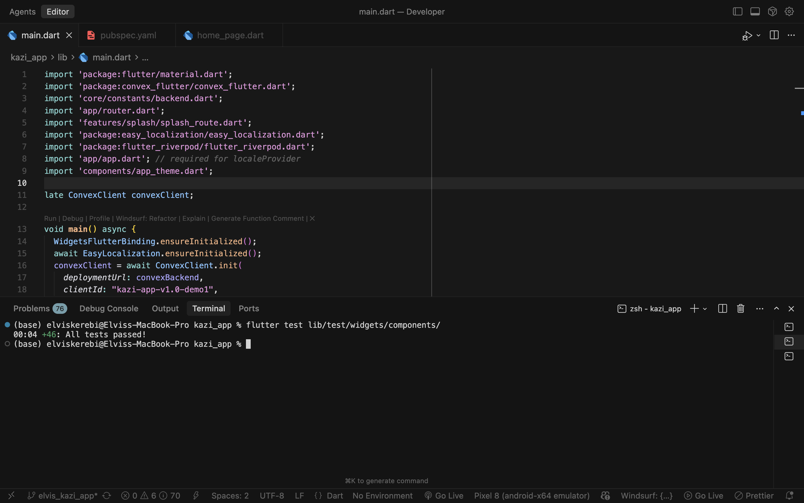
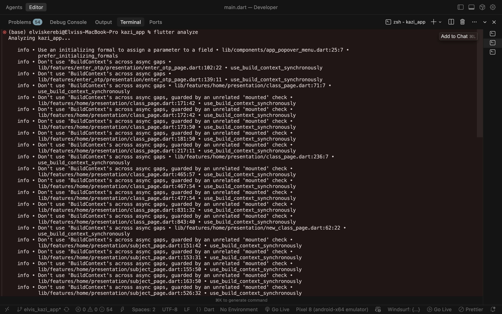
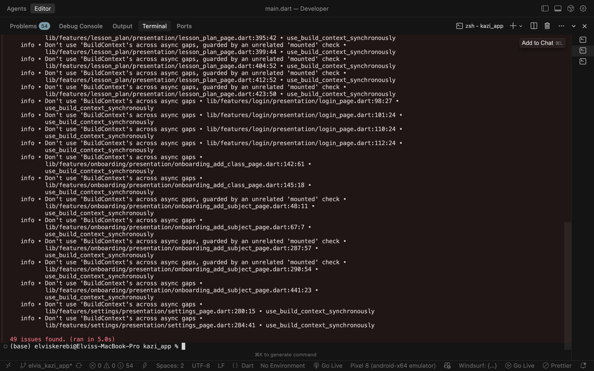

# Kazi App

A comprehensive Flutter-based lesson planning application designed for teachers to manage classes, subjects, and create detailed lesson plans. The app features multi-language support (English, French, Kinyarwanda), markdown-based lesson plan editing, and PDF/DOCS export functionality.


## 📱 Features

### Core Functionality
- **Class Management**: Create, edit, and organize classes with grade levels
- **Subject Management**: Add and manage subjects for each class
- **Lesson Plan Creation**: Create, edit, and manage detailed lesson plans with markdown support
- **Lesson Plan Export**: Download lesson plans as PDF or text documents
- **Multi-language Support**: Full localization in English, French, and Kinyarwanda
- **User Authentication**: Secure login with email/password or Google OAuth
- **Dashboard Overview**: Quick access to classes, subjects, and lesson plan counts

### Technical Features
- **Real-time Data Sync**: Powered by Convex backend for instant updates
- **Markdown Editor**: Rich text editing with markdown support for lesson plans
- **PDF Generation**: Convert lesson plans to PDF format
- **Responsive UI**: Modern, clean interface with Material Design
- **Widget Testing**: Comprehensive unit tests for UI components

## 🏗️ Architecture

### Frontend (Flutter)
- **Framework**: Flutter 3.9+
- **State Management**: Riverpod
- **Localization**: Easy Localization
- **Backend Integration**: Convex Flutter SDK
- **UI Components**: Custom Material Design components

### Backend (Convex)
- **Database**: Convex (serverless backend)
- **Authentication**: JWT-based auth with email verification
- **API**: RESTful HTTP endpoints via Convex HTTP actions
- **Real-time**: Automatic data synchronization

## 📋 Prerequisites

Before you begin, ensure you have the following installed:

- **Flutter SDK** (3.9.0 or higher)
- **Dart SDK** (comes with Flutter)
- **Node.js** (16.x or higher) - for Convex backend
- **npm** or **yarn** - for backend dependencies
- **Android Studio** / **Xcode** - for mobile development
- **VS Code** or **Android Studio** - recommended IDE

## 🚀 Getting Started

### 1. Clone the Repository

```bash
git clone <repository-url>
cd kazi_app
```

### 2. Flutter Setup

#### Install Dependencies

```bash
flutter pub get
```

#### Run the App

```bash
# For Android
flutter run

# For iOS
flutter run

# For a specific device
flutter devices
flutter run -d <device-id>
```

### 3. Backend Setup (Convex)

#### Navigate to Backend Directory

```bash
cd backend
```

#### Install Dependencies

```bash
npm install
```

#### Configure Convex

1. Create a Convex account at [convex.dev](https://convex.dev)
2. Create a new project
3. Copy your deployment URL and update `lib/core/constants/backend.dart`:

```dart
const String convexBackend = 'https://your-deployment.convex.site';
```

#### Run Convex Development Server

```bash
npm run dev
```

This will:
- Start the Convex development server
- Watch for changes in your Convex functions
- Open the Convex dashboard

### 4. Environment Configuration

#### Backend Environment Variables

Create a `.env` file in the `backend/` directory (if needed):

```env
CONVEX_DEPLOYMENT_URL=https://your-deployment.convex.site
```

## 📁 Project Structure

```
kazi_app/
├── lib/
│   ├── app/                  # App configuration, routing
│   ├── components/           # Reusable UI components
│   ├── core/                 # Core utilities, constants
│   ├── features/             # Feature modules
│   │   ├── auth/            # Authentication
│   │   ├── home/            # Home dashboard
│   │   ├── lesson_plan/     # Lesson plan details
│   │   ├── lesson_plans/    # Lesson plans list
│   │   ├── settings/        # Settings page
│   │   └── ...
│   ├── l10n/                # Localization files
│   ├── providers/           # Riverpod providers
│   └── shared/              # Shared services
├── backend/
│   └── convex/
│       ├── functions/       # Convex functions
│       │   ├── auth/        # Authentication functions
│       │   ├── classes/     # Class management
│       │   ├── subjects/    # Subject management
│       │   ├── lessonPlans/ # Lesson plan operations
│       │   └── teachers/    # Teacher management
│       ├── schema.ts         # Database schema
│       └── http.ts           # HTTP route handlers
├── test/
│   └── widgets/
│       └── components/      # Widget unit tests
└── assets/
    ├── images/              # App images
    └── fonts/               # Custom fonts (Inter)
```

## 🧪 Testing

### Run Widget Tests

```bash
flutter test test/widgets/components/
```

### Test Results



All widget tests are passing ✅ (46 tests)

### Run Code Analysis

```bash
flutter analyze
```

### Analysis Results




Current status: **49 issues found** (mostly informational linting suggestions)

## 🗄️ Database Schema (Convex)

### Tables

#### `teachers`
- `email`: string (indexed)
- `name`: optional string
- `language`: "english" | "french" | "kiryanwanda"
- `googleId`: optional string (indexed)
- `hashedPassword`: optional string
- `verificationCode`: optional string
- `verified`: optional boolean

#### `classes`
- `teacherId`: Id<"teachers"> (indexed)
- `name`: string
- `gradeLevel`: string
- `academicYear`: optional string
- `createdAt`: number

#### `subjects`
- `classId`: Id<"classes"> (indexed)
- `teacherId`: Id<"teachers"> (indexed)
- `name`: string
- `createdAt`: number

#### `lessonPlans`
- `subjectId`: Id<"subjects"> (indexed)
- `teacherId`: Id<"teachers"> (indexed)
- `title`: string
- `content`: any (markdown content)
- `objective`: optional string
- `createdAt`: number
- `updatedAt`: optional number

## 🔌 Convex Backend API

### Authentication Endpoints

- `POST /api/auth/createAccount` - Create new teacher account
- `POST /api/auth/login` - Login with email/password
- `POST /api/auth/googleLogin` - Google OAuth login
- `POST /api/auth/verifyEmail` - Verify email with OTP code
- `POST /api/auth/resetPassword` - Reset password

### Classes Endpoints

- `GET /api/classes` - Get all classes for a teacher
- `POST /api/classes` - Create a new class
- `PATCH /api/classes/:id` - Update a class
- `DELETE /api/classes/:id` - Delete a class

### Subjects Endpoints

- `GET /api/subjects` - Get subjects for a class
- `POST /api/subjects` - Add subjects to a class
- `PATCH /api/subjects/:id` - Update a subject
- `DELETE /api/subjects/:id` - Delete a subject

### Lesson Plans Endpoints

- `GET /api/lessonPlans` - Get all lesson plans for a teacher
- `GET /api/lessonPlans/:id` - Get a specific lesson plan
- `POST /api/lessonPlans` - Create a new lesson plan
- `PATCH /api/lessonPlans/:id` - Update a lesson plan
- `DELETE /api/lessonPlans/:id` - Delete a lesson plan

### Convex Functions

All backend logic is implemented as Convex functions in `backend/convex/functions/`:

- **Queries**: Real-time data fetching (e.g., `getClasses`, `getClassSubjects`)
- **Mutations**: Data modifications (e.g., `addClass`, `createLessonPlan`)
- **Actions**: External API calls and complex operations (e.g., `sendVerificationEmail`)

## 🎨 UI Components

The app includes a comprehensive set of reusable components:

- **AppButton**: Multi-variant button component (primary, secondary, destructive, outline, ghost)
- **AppInput**: Form input with validation, error states, and icons
- **AppCheckbox**: Custom checkbox with label and error states
- **AppBottomSheet**: Modal bottom sheet component
- **AppPageHeader**: Consistent page header with back button and actions
- **DownloadLessonPlanBottomSheet**: Download options for lesson plans

See `test/widgets/components/` for comprehensive unit tests.

## 🌍 Localization

The app supports three languages:

- **English** (`en.json`)
- **French** (`fr.json`)
- **Kinyarwanda** (`rw.json`)

Language files are located in `lib/l10n/`. Users can switch languages from the settings page, and the preference is saved and synced across all pages.

## 📦 Key Dependencies

### Flutter Packages

- `convex_flutter`: Convex backend integration
- `flutter_riverpod`: State management
- `easy_localization`: Multi-language support
- `flutter_markdown`: Markdown rendering
- `pdf`: PDF generation
- `share_plus`: File sharing
- `path_provider`: File system paths
- `http`: HTTP requests
- `flutter_appauth`: Google OAuth authentication

### Backend Packages

- `convex`: Convex backend SDK
- `jsonwebtoken`: JWT token handling
- `bcryptjs`: Password hashing
- `google-auth-library`: Google OAuth verification
- `resend`: Email sending
- `pdf-lib`: PDF generation (backend)

## 🛠️ Development

### Running in Development Mode

```bash
# Terminal 1: Run Flutter app
flutter run

# Terminal 2: Run Convex backend
cd backend
npm run dev
```

### Building for Production

```bash
# Android
flutter build apk --release
flutter build appbundle --release

# iOS
flutter build ios --release
```

## 📝 Code Quality

### Linting

The project uses `flutter_lints` for code quality. Run analysis:

```bash
flutter analyze
```

### Widget Testing

Comprehensive widget tests are available in `test/widgets/components/`:

- `app_button_test.dart` - 12 tests
- `app_input_test.dart` - 16 tests  
- `app_checkbox_test.dart` - 16 tests

Total: **46 tests** - All passing ✅

## 🐛 Troubleshooting

### Common Issues

#### Convex Connection Issues
- Ensure Convex dev server is running (`npm run dev` in `backend/`)
- Verify deployment URL in `lib/core/constants/backend.dart`
- Check network connectivity

#### Plugin Registration Errors
- Run `flutter clean`
- Run `flutter pub get`
- **Restart the app completely** (not just hot reload)

#### Build Errors
- Ensure all dependencies are installed: `flutter pub get`
- Clear build cache: `flutter clean`
- Verify Flutter/Dart SDK versions

## 📄 License

This project is private and not intended for public distribution.

## 🤝 Contributing

This is a private project. For questions or issues, please contact the development team.

## 📞 Support

For technical support or questions about the app, please refer to the development team.

---

**Built with ❤️ using Flutter and Convex**
